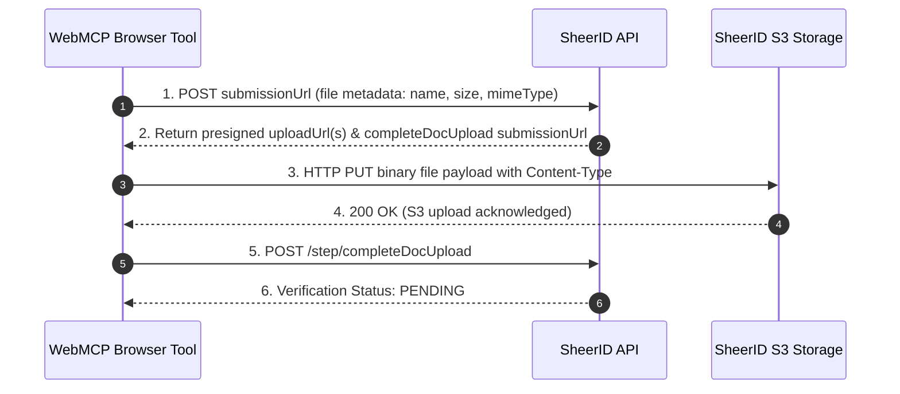
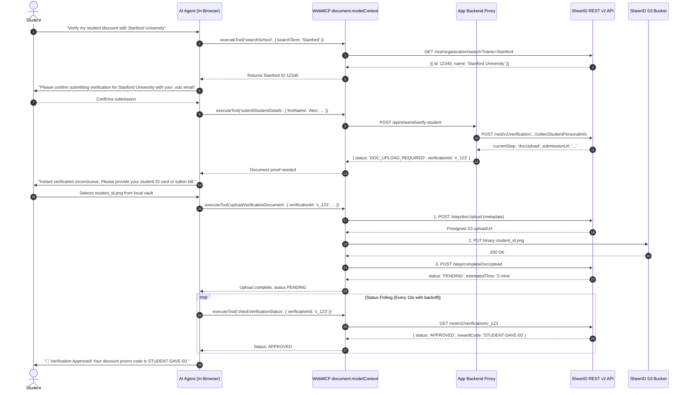

# SheerID Verification Architecture & WebMCP Integration Specification

> **Status:** Architecture Reference & Implementation Guide  
> **Primary Sources:** [SheerID Developer Center (REST API v2)](https://developer.sheerid.com/), [W3C WebML CG WebMCP Draft Spec](https://webmachinelearning.github.io/webmcp/), [Chrome WebMCP Documentation](https://developer.chrome.com/docs/ai/webmcp/)

---

## 1. Executive Summary

Digital student verification traditionally faces a dilemma: either users navigate multi-step forms with external document review delays, or autonomous agents attempt brittle DOM scraping of sensitive school portals, exposing student PII and session credentials to remote backend servers.

**WebMCP (Web Model Context Protocol)** solves this by executing structured AI agent tools directly within the student's browser sandbox. Combined with **SheerID's REST API v2 step-based state machine**, WebMCP enables:
1. **Zero-PII Leakage to AI Cloud Proxies:** Identity verification tokens, student IDs, and personal information are processed client-side without third-party scraping servers.
2. **Deterministic Step Machine:** Direct integration with SheerID's authoritative databases (National Student Clearinghouse, university registrars, SSO/eduGAIN) with graceful fallback to document upload.
3. **Resilient Multimodal Verification:** The browser agent guides the student through document capture, validates file requirements, inspects rejection codes (e.g., outdated term date, unreadable image), and handles retries autonomously with human-in-the-loop checkpoints.

---

## 2. SheerID REST API v2 Lifecycle & Official Specification

SheerID REST API v2 operates as a **dynamic step-driven finite state machine**. Rather than hardcoding static endpoints, the client submits data to a dynamic `submissionUrl` returned by each state transition.

```
       ┌────────────────────────┐
       │  Program Configuration │  GET /rest/v2/program/{programId}/theme
       └───────────┬────────────┘
                   ▼
       ┌────────────────────────┐
       │  Organization Search   │  GET https://orgsearch.sheerid.net/rest/organization/search
       └───────────┬────────────┘
                   ▼
       ┌────────────────────────┐
       │ Collect Student Info   │  POST /rest/v2/verification (or composite step)
       └───────────┬────────────┘
                   │
         Authoritative DB Check
                   │
         ┌─────────┴─────────┐
         ▼                   ▼
   [Instant Match]     [Fallback Needed]
         │                   │
         ▼                   ▼
   ┌───────────┐       ┌───────────┐
   │  SUCCESS  │       │ docUpload │  POST file metadata -> S3 presigned PUTs
   └───────────┘       └─────┬─────┘
                             ▼
                       ┌───────────┐
                       │  PENDING  │  Polling / Webhook review
                       └─────┬─────┘
                             │
                  ┌──────────┴──────────┐
                  ▼                     ▼
            ┌───────────┐         ┌───────────┐
            │  SUCCESS  │         │ REJECTED  │ (e.g. EXPIRED_DOCUMENT)
            └───────────┘         └─────┬─────┘
                                        ▼
                                  [Retry Step] (up to max attempts)
```

---

### 2.1 Authentication & Program Configuration

SheerID API requests use OAuth 2.0 Bearer tokens. In client-side WebMCP deployments, requests route through an authorized backend proxy or use a client-safe public program token.

#### Discovering the Organization Search Endpoint
Programs have dedicated search configurations (e.g., country filters, university vs. K-12):
```http
GET /rest/v2/program/{programId}/theme HTTP/1.1
Host: services.sheerid.com
Authorization: Bearer {ACCESS_TOKEN}
```
**Response:**
```json
{
  "config": {
    "orgSearchUrl": "https://orgsearch.sheerid.net/rest/organization/search?country=US&type=UNIVERSITY&name=",
    "rewardStrategy": "DEFAULT"
  }
}
```

---

### 2.2 Organization Search API

Organizations (universities, colleges, community colleges) are searched dynamically:
```http
GET https://orgsearch.sheerid.net/rest/organization/search?country=US&type=UNIVERSITY&name=Stanford HTTP/1.1
```
**Response:**
```json
[
  {
    "id": 12345,
    "name": "Stanford University",
    "country": "US",
    "city": "Stanford",
    "state": "CA",
    "type": "UNIVERSITY"
  }
]
```

---

### 2.3 Initializing Verification & Submitting Student Details

The verification session is initialized by submitting personal details:

```http
POST /rest/v2/verification/program/{programId}/step/collectStudentPersonalInfo HTTP/1.1
Host: services.sheerid.com
Content-Type: application/json

{
  "firstName": "Alex",
  "lastName": "Rivera",
  "email": "alex.rivera@stanford.edu",
  "birthDate": "2003-05-14",
  "organization": {
    "id": 12345,
    "name": "Stanford University"
  },
  "deviceFingerprintHash": "a1b2c3d4e5f6..."
}
```

#### Branch A: Instant Authoritative Match (Success)
If student data matches registrar / clearinghouse feeds:
```json
{
  "verificationId": "65e01ab924e2c814b7891234",
  "currentStep": "success",
  "status": "APPROVED",
  "rewardCode": "STUDENT-DISCOUNT-2026-XYZ"
}
```

#### Branch B: Fallback to Document Review (`docUpload`)
If not immediately matched, SheerID returns `docUpload` with a dedicated `submissionUrl`:
```json
{
  "verificationId": "65e01ab924e2c814b7891234",
  "currentStep": "docUpload",
  "submissionUrl": "https://services.sheerid.com/rest/v2/verification/65e01ab924e2c814b7891234/step/docUpload",
  "docUploadReviewTimeEstimate": "20 minutes"
}
```

---

### 2.4 Document Upload Multi-Stage Flow

The document upload process follows a 3-step handshake:



#### Step 1: Initiate Document Upload (Submit Metadata)
```http
POST /rest/v2/verification/{verificationId}/step/docUpload HTTP/1.1
Content-Type: application/json

{
  "files": [
    {
      "fileName": "enrollment_verification.pdf",
      "fileSize": 1428500,
      "mimeType": "application/pdf"
    }
  ]
}
```

#### Step 2: Receive Pre-signed S3 URLs
```json
{
  "verificationId": "65e01ab924e2c814b7891234",
  "currentStep": "completeDocUpload",
  "submissionUrl": "https://services.sheerid.com/rest/v2/verification/65e01ab924e2c814b7891234/step/completeDocUpload",
  "documents": [
    {
      "documentId": "doc_99a8b7c6",
      "fileName": "enrollment_verification.pdf",
      "uploadUrl": "https://sheerid-uploads.s3.amazonaws.com/verifications/65e01ab9.../doc_99a8b7c6?AWSAccessKeyId=AKIA...&Signature=..."
    }
  ]
}
```

#### Step 3: Direct S3 Binary Transfer
```http
PUT https://sheerid-uploads.s3.amazonaws.com/verifications/65e01ab9.../doc_99a8b7c6?... HTTP/1.1
Content-Type: application/pdf
Content-Length: 1428500

[Binary Stream]
```

#### Step 4: Finalize Document Submission
```http
POST /rest/v2/verification/{verificationId}/step/completeDocUpload HTTP/1.1
Content-Type: application/json

{}
```

---

### 2.5 Document Specifications & Constraints

| Parameter | Specification |
|---|---|
| **Accepted MIME Types** | `application/pdf`, `image/jpeg`, `image/png` |
| **Maximum File Size** | 10 MB per individual file |
| **Max File Count** | Max 3 files per upload attempt |
| **Max Retry Limit** | 3 document upload attempts per verification session |
| **Data Retention** | Uploaded documents purged after review (default 7 days) |
| **Accepted Document Types** | 1. Official Student ID Card (with current academic year)<br>2. Class Schedule / Registration receipt (with active dates)<br>3. Tuition Receipt / Bill for current term<br>4. Official / Unofficial Transcript |

---

### 2.6 Status Polling, Webhooks, & Failure Handling

#### Status Polling Endpoint
```http
GET /rest/v2/verification/{verificationId} HTTP/1.1
```

#### Rejection Codes & Error Taxonomy

| Rejection Code / Error ID | Type | Meaning & Recovery Action |
|---|---|---|
| `EXPIRED_DOCUMENT` | Recoverable | Document date is outside current academic term. Prompt for updated schedule. |
| `ILLEGIBLE_DOCUMENT` | Recoverable | Blurry image, low resolution, or unreadable text. Prompt for high-res PDF or clear photo. |
| `UNACCEPTED_DOCUMENT_TYPE` | Recoverable | Document is not on approved list (e.g. self-written letter). Prompt for official transcript/ID. |
| `NAME_MISMATCH` | Recoverable | Name on document does not match entered name. Correct typo or provide legal documentation. |
| `ORGANIZATION_MISMATCH` | Recoverable | Document is from a different institution than selected. |
| `INCOMPLETE_DOCUMENT` | Recoverable | Key elements missing (e.g. school logo, student name, or date). |
| `docReviewLimitExceeded` | Permanent | 3 upload attempts exhausted. Verification locked. |
| `verificationLimitExceeded` | Permanent | User reached maximum allowed lifetime verifications. |
| `reverificationDailyLimitExceeded` | Permanent | Daily rate limit exceeded. |

---

## 3. WebMCP Integration for Student Verification

### 3.1 Architecture Overview

```
TRADITIONAL SCRAPING PROXY (High Risk)
┌──────────────┐     PII / Passwords     ┌────────────────────┐     Scrapes     ┌────────────────┐
│ User Browser │ ──────────────────────> │ Third-Party Server │ ──────────────> │ Student Portal │
└──────────────┘                         └────────────────────┘                 └────────────────┘
                                            ▲ Leakage Risk!

WEBMCP BROWSER SANDBOX (Zero-PII Leakage)
┌─────────────────────────────────────────────────────────────┐
│ USER'S BROWSER (Secure Context)                             │
│                                                             │
│  ┌──────────────┐   WebMCP Tools   ┌─────────────────────┐  │     API / PUT     ┌─────────────────┐
│  │ AI Agent UI  │ <=============>  │ document.modelContext│ │ ────────────────> │ SheerID REST v2 │
│  └──────────────┘ (Local Tool Call)└──────────┬──────────┘  │                   └─────────────────┘
│                                               │             │
│                                               ▼             │
│                                    ┌─────────────────────┐  │
│                                    │ Local File / Vault  │  │
│                                    └─────────────────────┘  │
└─────────────────────────────────────────────────────────────┘
```

1. **Client-Side Sandbox Execution:** All tool calls execute inside the user's browser window (`document.modelContext`), honoring standard origin isolation and Content Security Policies.
2. **No Scraper Middleware:** The student's institutional credentials, student ID photos, and transcript data never transit through intermediary LLM orchestration clouds.
3. **Human-in-the-Loop Safeguards:** WebMCP `annotations: { readOnlyHint: false }` enforces clear UI prompts and user confirmations before identity documents are submitted.

---

## 4. WebMCP Tool Schemas & TypeScript Implementations

### Tool 1: `searchSchool` (Imperative)
Allows the agent to find verified university IDs for SheerID.

```typescript
export const searchSchoolTool: ModelContextTool = {
  name: "searchSchool",
  title: "Search Educational Institutions",
  description: "Searches the SheerID database for accredited colleges, universities, and high schools.",
  inputSchema: {
    type: "object",
    properties: {
      searchTerm: {
        type: "string",
        description: "Name or partial name of the university (e.g. 'Stanford', 'UC Berkeley')"
      },
      country: {
        type: "string",
        description: "Two-letter ISO country code (e.g. 'US', 'CA', 'GB')",
        default: "US"
      }
    },
    required: ["searchTerm"]
  },
  execute: async ({ searchTerm, country = "US" }, { signal }) => {
    const url = `https://orgsearch.sheerid.net/rest/organization/search?country=${encodeURIComponent(country)}&type=UNIVERSITY&name=${encodeURIComponent(searchTerm)}`;
    const response = await fetch(url, { signal });
    if (!response.ok) throw new Error(`School search failed: ${response.statusText}`);
    const results = await response.json();
    const formatted = results.slice(0, 5).map((org: any) => ({
      id: org.id,
      name: org.name,
      city: org.city,
      state: org.state
    }));
    return JSON.stringify({ count: formatted.length, schools: formatted });
  },
  annotations: {
    readOnlyHint: true,
    untrustedContentHint: false
  }
};
```

---

### Tool 2: `submitStudentDetails` (Imperative)
Submits student personal info to initiate verification.

```typescript
export const submitStudentDetailsTool: ModelContextTool = {
  name: "submitStudentDetails",
  title: "Submit Student Verification Details",
  description: "Submits student details (name, email, birth date, university ID) to SheerID to attempt instant verification.",
  inputSchema: {
    type: "object",
    properties: {
      firstName: { type: "string", description: "Legal first name" },
      lastName: { type: "string", description: "Legal last name" },
      email: { type: "string", description: "University student email address (.edu)" },
      birthDate: { type: "string", description: "Date of birth in YYYY-MM-DD format" },
      organizationId: { type: "integer", description: "SheerID organization ID from searchSchool" },
      organizationName: { type: "string", description: "Full official university name" }
    },
    required: ["firstName", "lastName", "email", "birthDate", "organizationId", "organizationName"]
  },
  execute: async (details, { signal }) => {
    const payload = {
      firstName: details.firstName,
      lastName: details.lastName,
      email: details.email,
      birthDate: details.birthDate,
      organization: { id: details.organizationId, name: details.organizationName }
    };

    const res = await fetch("/api/sheerid/verify-student", {
      method: "POST",
      headers: { "Content-Type": "application/json" },
      body: JSON.stringify(payload),
      signal
    });

    const data = await res.json();
    return JSON.stringify(data);
  },
  annotations: {
    readOnlyHint: false,
    untrustedContentHint: false
  }
};
```

---

### Tool 3: `uploadVerificationDocument` (Imperative)
Executes the SheerID pre-signed S3 upload lifecycle.

```typescript
export const uploadVerificationDocumentTool: ModelContextTool = {
  name: "uploadVerificationDocument",
  title: "Upload Student Proof Document",
  description: "Uploads an official student ID, tuition receipt, or transcript to SheerID when instant verification is inconclusive.",
  inputSchema: {
    type: "object",
    properties: {
      verificationId: {
        type: "string",
        description: "Active SheerID verification ID"
      },
      documentType: {
        type: "string",
        enum: ["STUDENT_ID", "CLASS_SCHEDULE", "TUITION_RECEIPT", "TRANSCRIPT"],
        description: "Category of proof document"
      },
      fileDataUrl: {
        type: "string",
        description: "Base64 Data URL of the document (PDF, PNG, or JPEG)"
      },
      fileName: {
        type: "string",
        description: "File name including extension (e.g. 'tuition_bill_2026.pdf')"
      }
    },
    required: ["verificationId", "documentType", "fileDataUrl", "fileName"]
  },
  execute: async ({ verificationId, fileDataUrl, fileName }, { signal }) => {
    const blobResponse = await fetch(fileDataUrl);
    const blob = await blobResponse.blob();
    const mimeType = blob.type || "application/pdf";

    if (blob.size > 10 * 1024 * 1024) {
      throw new Error("File exceeds maximum SheerID limit of 10MB.");
    }

    const initRes = await fetch(`/api/sheerid/${verificationId}/docUpload`, {
      method: "POST",
      headers: { "Content-Type": "application/json" },
      body: JSON.stringify({ files: [{ fileName, fileSize: blob.size, mimeType }] }),
      signal
    });
    if (!initRes.ok) throw new Error(`docUpload initiation failed: ${initRes.statusText}`);
    const initData = await initRes.json();

    const s3Url = initData.documents[0].uploadUrl;
    const putRes = await fetch(s3Url, {
      method: "PUT",
      headers: { "Content-Type": mimeType },
      body: blob,
      signal
    });
    if (!putRes.ok) throw new Error(`S3 direct upload failed: ${putRes.statusText}`);

    const completeRes = await fetch(initData.submissionUrl, {
      method: "POST",
      headers: { "Content-Type": "application/json" },
      body: "{}",
      signal
    });
    const finalData = await completeRes.json();

    return JSON.stringify({
      status: finalData.status || "PENDING",
      currentStep: finalData.currentStep,
      message: "Document submitted successfully. Review in progress (estimated 5-20 mins)."
    });
  },
  annotations: {
    readOnlyHint: false,
    untrustedContentHint: false
  }
};
```

---

### Tool 4: `checkVerificationStatus` (Imperative Polling)
```typescript
export const checkVerificationStatusTool: ModelContextTool = {
  name: "checkVerificationStatus",
  title: "Check Verification Status",
  description: "Polls current verification status, approval reward codes, or document rejection reasons.",
  inputSchema: {
    type: "object",
    properties: {
      verificationId: { type: "string", description: "Active verification session ID" }
    },
    required: ["verificationId"]
  },
  execute: async ({ verificationId }, { signal }) => {
    const res = await fetch(`/api/sheerid/verification/${verificationId}`, { signal });
    if (!res.ok) throw new Error("Failed to retrieve verification status");
    const data = await res.json();
    return JSON.stringify({
      status: data.status,
      currentStep: data.currentStep,
      rejectionReasons: data.rejectionReasons || [],
      rewardCode: data.rewardCode || null
    });
  },
  annotations: {
    readOnlyHint: true,
    untrustedContentHint: false
  }
};
```

---

### Tool 5: `retryWithNewDocument` (Imperative Recovery)
```typescript
export const retryWithNewDocumentTool: ModelContextTool = {
  name: "retryWithNewDocument",
  title: "Retry Verification With Corrected Document",
  description: "Handles recoverable document rejection (e.g. EXPIRED_DOCUMENT, ILLEGIBLE_DOCUMENT) by uploading a replacement document.",
  inputSchema: {
    type: "object",
    properties: {
      verificationId: { type: "string", description: "Verification ID" },
      remedyType: {
        type: "string",
        enum: ["CLEARER_IMAGE", "RECENT_TERM_DATE", "MATCHING_NAME_DOC", "OFFICIAL_TRANSCRIPT"],
        description: "The corrective remedy being applied"
      },
      fileDataUrl: { type: "string", description: "New document Base64 Data URL" },
      fileName: { type: "string", description: "New file name" }
    },
    required: ["verificationId", "remedyType", "fileDataUrl", "fileName"]
  },
  execute: async (args, options) => {
    return uploadVerificationDocumentTool.execute(args, options);
  },
  annotations: {
    readOnlyHint: false,
    untrustedContentHint: false
  }
};
```

---

## 5. End-to-End Sequence



---

## 6. Primary Source References

1. **SheerID Developer Center REST API v2 Guide:** [https://developer.sheerid.com/](https://developer.sheerid.com/)
2. **SheerID Verification Flow & Document Upload Reference:** [https://developer.sheerid.com/rest-api](https://developer.sheerid.com/rest-api)
3. **W3C Web Machine Learning Community Group — WebMCP Draft:** [https://webmachinelearning.github.io/webmcp/](https://webmachinelearning.github.io/webmcp/)
4. **Google Chrome WebMCP Imperative API:** [https://developer.chrome.com/docs/ai/webmcp/imperative-api](https://developer.chrome.com/docs/ai/webmcp/imperative-api)
5. **Google Chrome WebMCP Declarative API:** [https://developer.chrome.com/docs/ai/webmcp/declarative-api](https://developer.chrome.com/docs/ai/webmcp/declarative-api)
